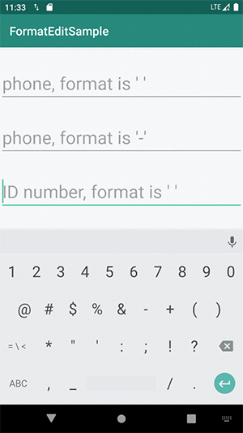

English | [简体中文](./README_CN.md)

# FormatEdit

An easy to use format edit library for Android. 

[](https://search.maven.org/artifact/cc.taylorzhang/format-edit)
[](https://android-arsenal.com/api?level=14)
[](LICENSE)

## Download

```groovy
repositories {
    mavenCentral()
}

dependencies {
    implementation 'cc.taylorzhang:format-edit:1.1.0'
}
```

## Usage

### Format edit phone

layout：

```xml
<androidx.appcompat.widget.AppCompatEditText
    android:id="@+id/etPhone"
    android:layout_width="match_parent"
    android:layout_height="wrap_content"
    android:inputType="number" />
```

kotlin:

```kotlin
// format is ' '
etPhone.setFormatRules(3, 4, 4)

// format is '-'
etPhone.setFormatRules(3, 4, 4, formatChar = '-')
```


### Format edit ID number

layout:

```xml
<androidx.appcompat.widget.AppCompatEditText
    android:id="@+id/etIDNumber"
    android:layout_width="match_parent"
    android:layout_height="wrap_content"
    android:digits="@string/digits_id_number"/>
```

resources:

```xml
<string name="digits_id_number">0123456789xX</string>
```

kotlin:

```kotlin
etIDNumber.setFormatRules(6, 4, 4, 4)
```



### Set listener

```kotlin
etPhone.setOnFormatEditListener { isComplete, text ->
    if (isComplete) { // edit complete
        // toast current text with format removed.
        Toast.makeText(this, text, Toast.LENGTH_SHORT).show()
    }
}
```

### Text with format removed

```kotlin
etPhone.textWithFormatRemoved
```

## License

[Apache license 2.0](LICENSE) © Taylor Zhang