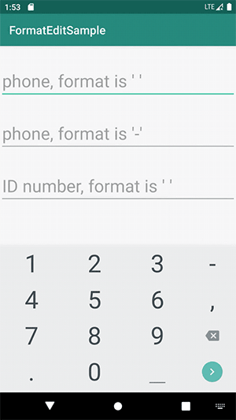

[English](./README.md) | 简体中文

# FormatEdit

一个易于使用的 Android 格式化编辑库。

[](https://bintray.com/taylorzhang/maven/format-edit/)
[](https://android-arsenal.com/api?level=14)
[](LICENSE)
[](https://github.com/RichardLitt/standard-readme)

## 下载

```groovy
dependencies {
    implementation 'cc.taylorzhang:format-edit:1.1.0'
}
```

## 使用

### 格式化编辑手机号

布局：

```xml
<androidx.appcompat.widget.AppCompatEditText
    android:id="@+id/etPhone"
    android:layout_width="match_parent"
    android:layout_height="wrap_content"
    android:inputType="number" />
```

代码:

```kotlin
// format is ' '
etPhone.setFormatRules(3, 4, 4)

// format is '-'
etPhone.setFormatRules(3, 4, 4, formatChar = '-')
```



### 格式化编辑身份证号

布局:

```xml
<androidx.appcompat.widget.AppCompatEditText
    android:id="@+id/etIDNumber"
    android:layout_width="match_parent"
    android:layout_height="wrap_content"
    android:digits="@string/digits_id_number"/>
```

资源:

```xml
<string name="digits_id_number">0123456789xX</string>
```

代码:

```kotlin
etIDNumber.setFormatRules(6, 4, 4, 4)
```


### 设置监听

```kotlin
etPhone.setOnFormatEditListener { isComplete, text ->
    if (isComplete) { // 编辑完成
        // 使用 toast 显示移除格式化的文本
        Toast.makeText(this, text, Toast.LENGTH_SHORT).show()
    }
}
```

### 移除格式化的文本

```kotlin
etPhone.textWithFormatRemoved
```

## 许可证

[Apache license 2.0](LICENSE) © Taylor Zhang